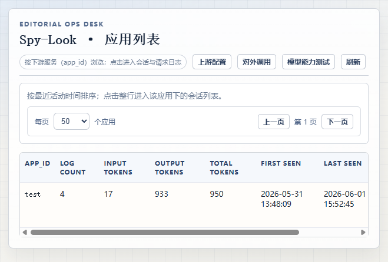
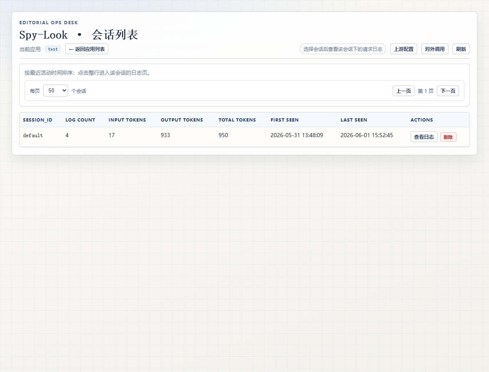
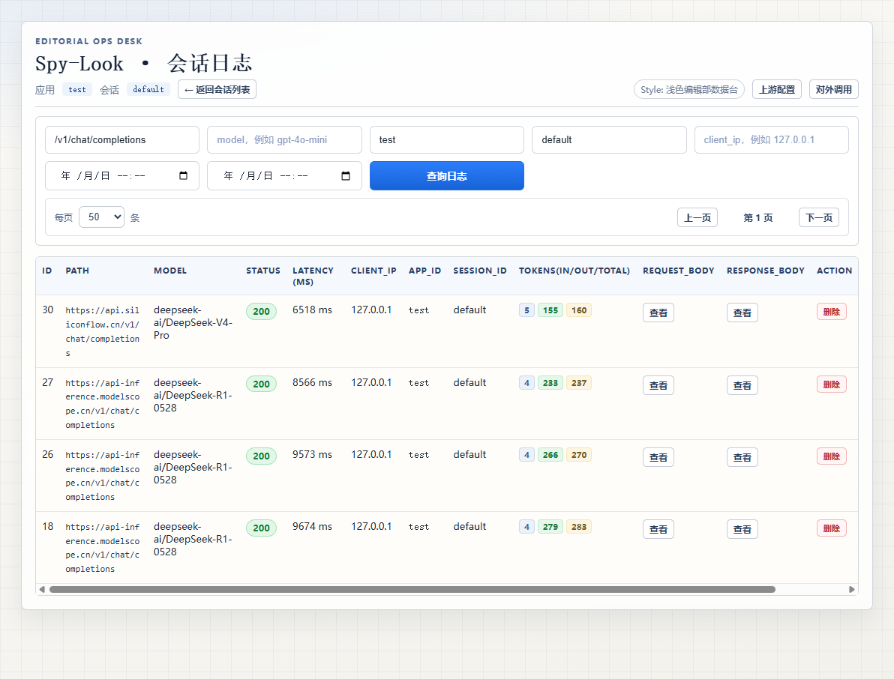
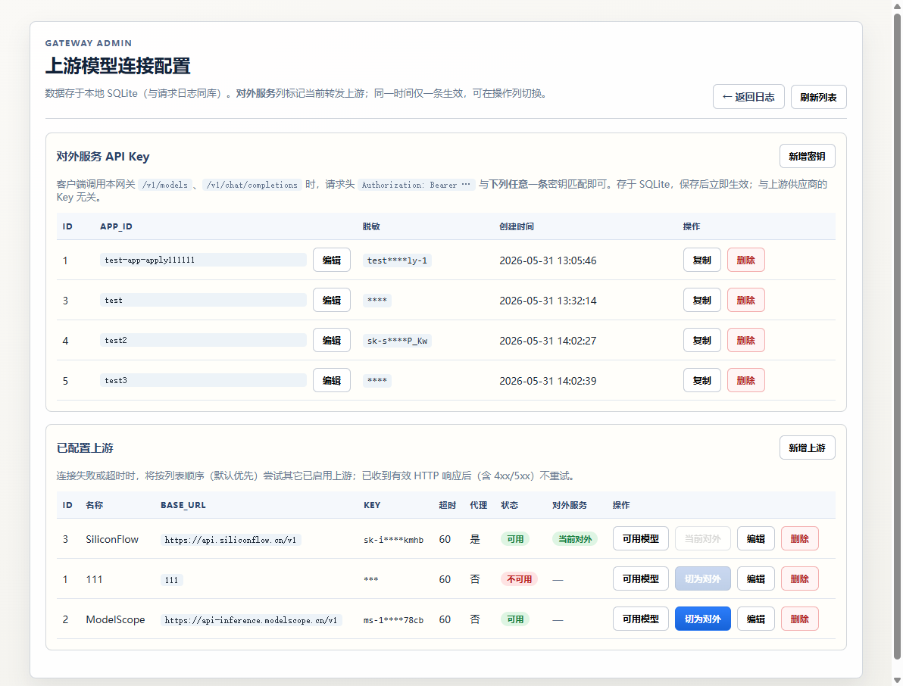
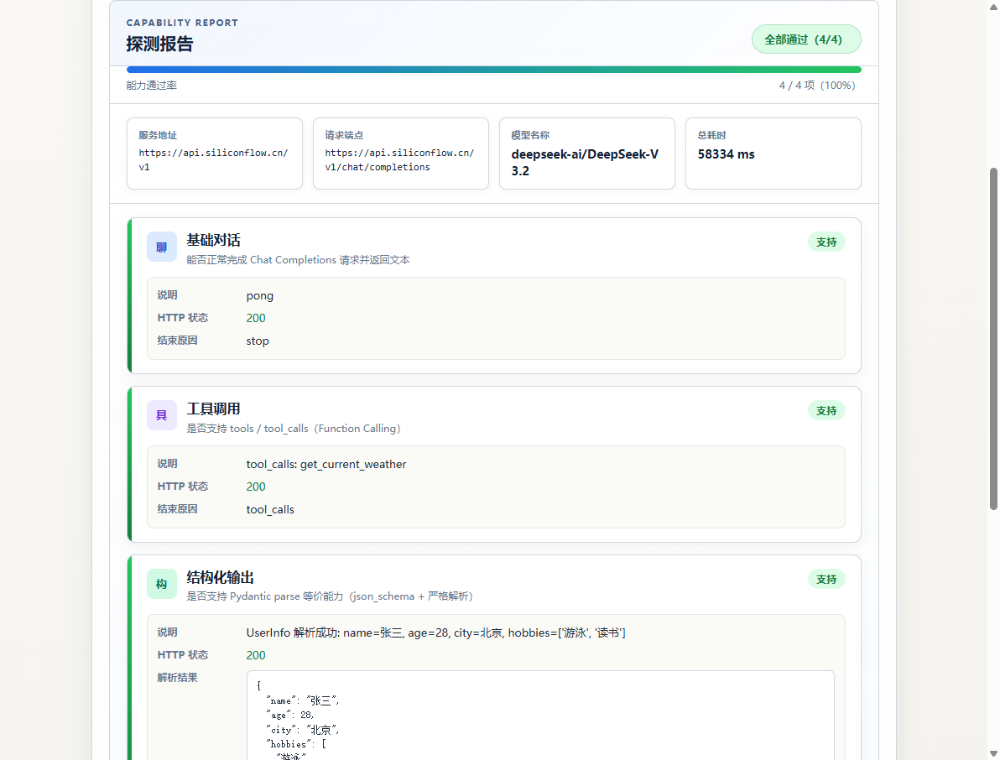

# Spy-Look

**个人工具合集** — 常用小工具集中在一个本地服务里，按需选用。

当前已内置 **大模型网关**：OpenAI 兼容代理 + 请求追踪 + 对外模型路由 + 模型能力探测。更多工具将陆续加入。

```bash
cd api
uv run main.py
# → http://127.0.0.1:8000
```

浏览器打开后，从左侧菜单进入各工具；首页提供工具箱概览与快捷入口。

---

## 工具：大模型网关

把 `/v1/chat/completions` 接到 Spy-Look，立刻获得：按应用/会话分级的请求追踪、完整 request/response 落库、Token 统计、对外模型抽象与负载均衡，以及一键模型能力探测——无需额外部署 Grafana / ELK。

### 1. 三级可观测：应用 → 会话 → 请求

每条对外 API Key 绑定唯一 **`app_id`**（标识下游服务）；对话请求可在请求头携带 **`X-Session-Id`** 区分多路会话。内置控制台按三级钻取，排障时不用在海量日志里盲搜。

| 应用列表 | 会话列表 | 请求日志 |
|:---:|:---:|:---:|
|  |  |  |

- **Token 统计**：每条请求记录 input / output / total tokens，应用与会话层自动聚合
- **完整报文**：request / response body 全量落库，点「查看」即可还原现场
- **多维筛选**：按 path、model、时间区间、client_ip 等组合查询
- **流式支持**：SSE 流结束后拼接完整内容写入，与非流式体验一致

### 2. 模型源 + 对外模型双层配置

**模型源配置**管理真实 LLM 提供商的连接信息；**对外模型配置**定义客户端可见的模型名，并映射到具体模型源与实际模型。多源绑定时，网关通过 `X-Session-Id` 做一致性哈希路由，同一客户端始终打到同一源；连接失败时在绑定池内 Failover。



- 对外 API Key 与模型源 Key 分离管理，Key 服务端自动生成
- `/v1/models` 仅返回对外模型配置，不再暴露上游真实模型列表
- 支持 1 对多模型源绑定，带会话粘性负载均衡

### 3. 模型能力一键探测

接入新模型或换供应商时，不用写脚本逐个试 Function Calling、JSON Mode、Thinking 参数——选上游和模型，点「开始探测」，几十秒后拿到结构化中文报告。



探测项包括：

| 能力 | 说明 |
|------|------|
| 基础对话 | Chat Completions 是否正常返回 |
| 工具调用 | `tools` / `tool_calls`（Function Calling） |
| 结构化输出 | `json_schema` + 严格解析 |
| 思考模式 | 是否输出 reasoning，能否用参数开关 |

支持「选择已配置上游」或「自定义 uri + api_key」两种模式。

### 4. OpenAI 兼容 API，零改造接入

客户端只需把 `base_url` 指向 Spy-Look，并使用对外模型配置中的模型名：

```bash
curl http://127.0.0.1:8000/v1/chat/completions \
  -H "Authorization: Bearer <your-gateway-key>" \
  -H "Content-Type: application/json" \
  -H "X-Session-Id: user-42-chat-1" \
  -d '{
    "model": "gpt-4o-mini",
    "messages": [{"role": "user", "content": "hello"}]
  }'
```

| 接口 | 说明 |
|------|------|
| `POST /v1/chat/completions` | 对话（流式 / 非流式） |
| `GET /v1/models` | 对外模型列表 |
| `GET /healthz` | 健康检查 |

控制台专用管理/日志 API 位于 `/gateway/admin/*` 与 `/gateway/logs/*`（**Breaking change**：旧版 `/admin/*`、`/logs/*` 已移除）。

错误响应统一为 OpenAI 风格 `{"error": {...}}`，网关超时 / 上游不可达 / 鉴权失败各有明确 error code。

---

## 快速开始

**环境**：Python ≥ 3.13，推荐 [uv](https://docs.astral.sh/uv/)

```bash
git clone https://github.com/<your-org>/spy-look.git
cd spy-look/api
uv sync
uv run main.py
```

浏览器打开 [http://127.0.0.1:8000](http://127.0.0.1:8000)：

1. 首页 → **大模型网关** → **模型配置**，添加模型源、创建对外模型映射，并创建对外 API Key（填写 `app_id`）
2. 用 Key 调用 `/v1/chat/completions`（请求头携带 `X-Session-Id`）
3. **请求日志** 中按 **应用 → 会话 → 日志** 查看请求详情

> **升级说明**：若从旧版升级，需在「对外模型配置」中手动创建对外模型映射；旧版请求体中的 `session_id` 已改为请求头 `X-Session-Id`。

### 前端开发（可选）

```bash
cd ui
npm install
npm run dev    # Vite 开发服务器，API 代理到 8000
npm run build  # 产物输出到 ui/dist，由 FastAPI 托管
```

### 环境变量（可选）

| 变量 | 默认值 | 说明 |
|------|--------|------|
| `SPY_LOOK_HOST` | `127.0.0.1` | 监听地址 |
| `SPY_LOOK_PORT` | `8000` | 监听端口 |
| `SPY_LOOK_RELOAD` | 关闭 | 设为 `1` / `true` 开启热重载 |

---

## 技术栈

FastAPI · httpx · SQLite · Vue 3 · Element Plus · Vite

```
spy-look/
├── api/                     # FastAPI 后端（工具模块化）
│   ├── main.py
│   ├── db/                  # 共享 SQLite 层
│   └── tools/gateway/       # 大模型网关工具
├── ui/                      # Vue 控制台源码 → ui/dist 静态托管
├── screenshots/
└── openspec/
```

---

## 适合谁用

- 想把常用个人工具（网关、后续更多）收拢到一个本地服务
- 本地开发 / 小团队：给 LLM 调用加一层网关，顺便看清每次请求的详细信息
- 多下游服务：用 `app_id` + `X-Session-Id` 把日志按业务线、对话隔离
- 多模型源场景：SiliconFlow、ModelScope、自建 vLLM……配置对外模型映射，带会话粘性负载均衡
- 接新模型：用能力探测页快速确认 Function Calling / JSON Mode 是否可用

---

## License

见 [LICENSE](LICENSE)。
