# Spy-Look

**个人工具合集** — 常用小工具集中在一个本地服务里，按需选用，开箱即用。

已内置五类工具：**大模型网关**、**视频工具**、**文档工具**、**图片工具**、**Agent 资源**；控制台需首次创建 Owner 账号后登录使用。

---

## 快速开始

**环境**：Python ≥ 3.13（推荐 [uv](https://docs.astral.sh/uv/)），Node.js（前端开发时）

### 仅后端（静态 UI 已构建时）

```bash
cd api
uv sync
uv run main.py
# → http://127.0.0.1:8000
```

### 开发模式（前后端分离）

Windows 可直接双击根目录 `boot.bat`，或手动：

```bash
# 终端 1
cd api && uv sync && uv run main.py

# 终端 2
cd ui && npm install && npm run dev
# → http://127.0.0.1:5400（API 代理到 8000）
```

首次打开会进入 **初始化** 页，创建 Owner 账号后登录。之后从左侧菜单或首页卡片进入各工具。

---

## 工具一览

| 工具 | 能力 |
|------|------|
| **大模型网关** | OpenAI 兼容代理、请求追踪、对外模型路由、能力探测、Token/显存估算 |
| **视频工具** | 视频转文字（页面链接 / 上传 / 直链） |
| **文档工具** | Markdown 转 Word、标题编号、在线 MD 编辑器 |
| **图片工具** | 本地 OCR、公式识别、版面识别 |
| **Agent 资源** | Skills 导入、标签筛选、版本与 zip 导出 |

---

## 大模型网关

把 `/v1/chat/completions` 接到 Spy-Look，即可获得：按应用 / 会话分级的请求追踪、完整 request/response 落库、Token 统计、对外模型抽象与负载均衡，以及一键模型能力探测。

### 可观测：应用 → 会话 → 请求

每条对外 API Key 绑定唯一 `app_id`；对话请求可在请求头携带 `X-Session-Id`。控制台按三级钻取，并提供仪表盘（请求量、Token、近 14 天趋势）。

| 仪表盘 | 会话列表 | 请求日志 |
|:---:|:---:|:---:|
| 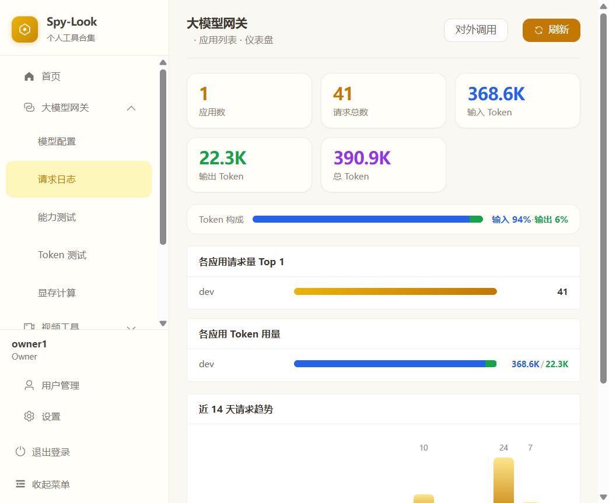 | 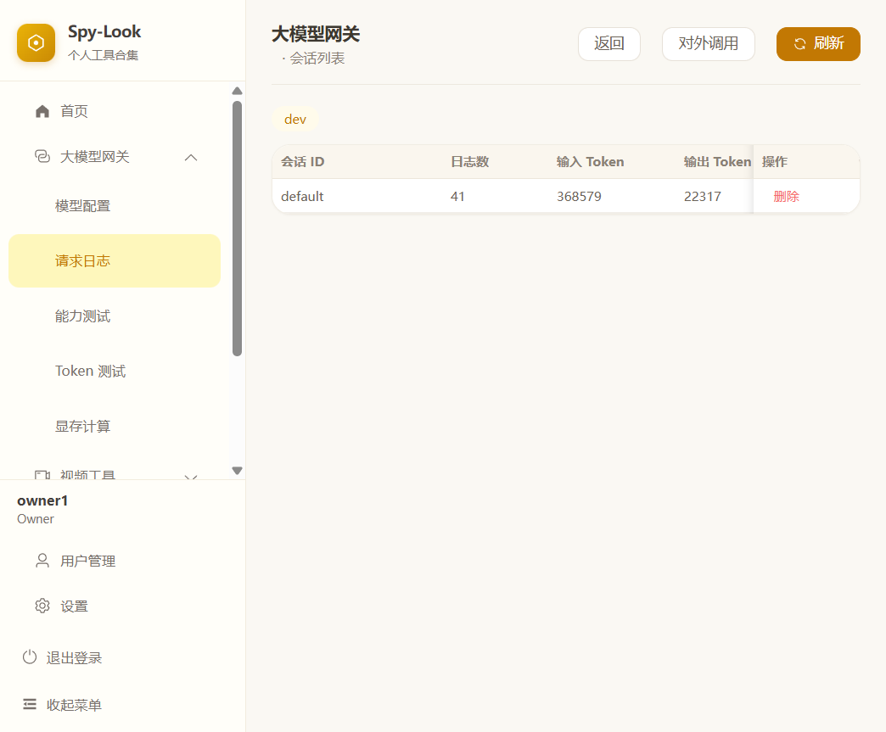 | 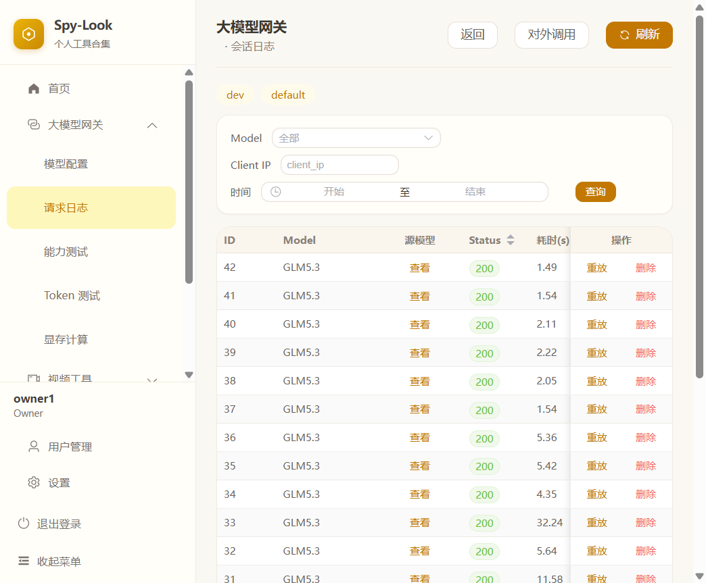 |

- **Token 统计**：每条请求记录 input / output / total，应用与会话层自动聚合
- **完整报文**：request / response body 落库，可查看与重放
- **多维筛选**：按 model、client_ip、时间区间等组合查询
- **流式支持**：SSE 结束后拼接完整内容写入，与非流式一致

### 模型源 + 对外模型

**模型源**管理真实 LLM 提供商连接；**对外模型**定义客户端可见模型名，并映射到模型源。多源绑定时按 `X-Session-Id` 一致性哈希路由，确保提示缓存命中，失败时在绑定池内 Failover。

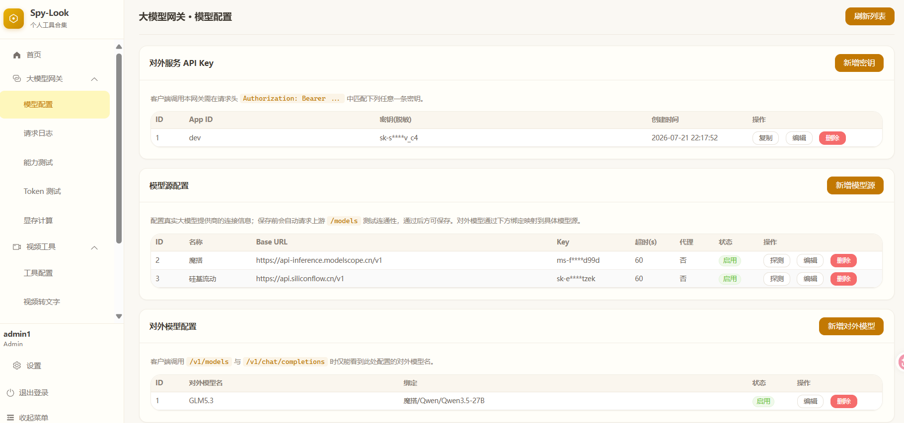

- 对外 API Key 与模型源 Key 分离，Key 由服务端生成
- `/v1/models` 仅返回对外模型，不暴露上游真实列表

### 能力探测 / 显存估算

选上游与模型即可探测 Chat / Embedding / Rerank 能力；显存页可估算权重与 KV Cache 占用。

| 能力测试 | 显存计算 |
|:---:|:---:|
| 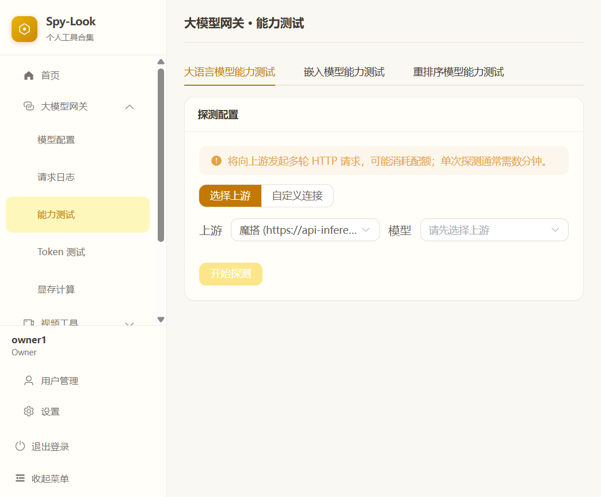 | 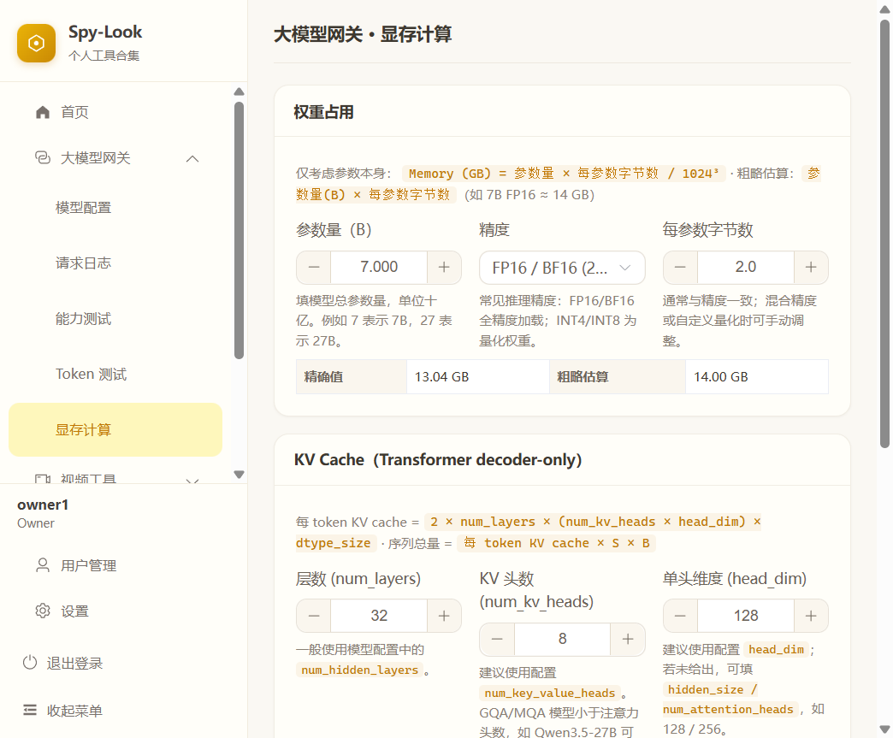 |

### OpenAI 兼容接入

```bash
curl http://127.0.0.1:8000/v1/chat/completions \
  -H "Authorization: Bearer <your-gateway-key>" \
  -H "Content-Type: application/json" \
  -H "X-Session-Id: user-42-chat-1" \
  -d '{
    "model": "gpt-4o-mini",
    "messages": [{"role": "user", "content": "hello"}]
  }'
```

| 接口 | 说明 |
|------|------|
| `POST /v1/chat/completions` | 对话（流式 / 非流式） |
| `GET /v1/models` | 对外模型列表 |
| `GET /healthz` | 健康检查 |

管理与日志 API 位于 `/gateway/admin/*`、`/gateway/logs/*`。控制台路由需登录 Cookie；网关对外 `/v1` 使用 Bearer Key。

---

## 其他工具

### 视频转文字

支持哔哩哔哩 / YouTube / 抖音等页面链接（yt-dlp）、本地上传，或 MP4 直链；可在「工具配置」中调整转写相关参数。

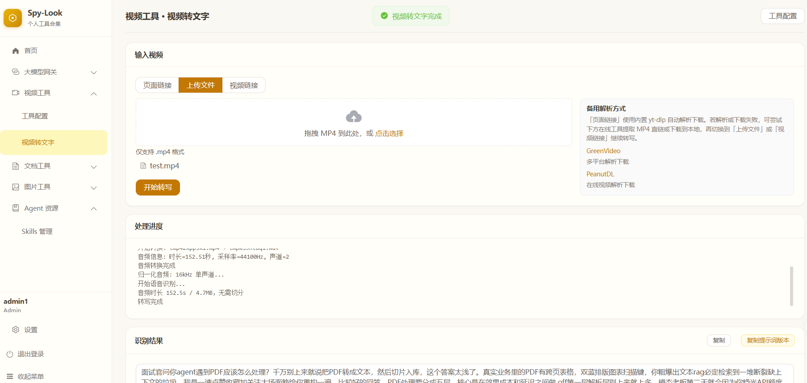

### 文档工具

Markdown 粘贴或上传后转 DOCX，可配置标题样式与多级编号；另有标题编号工具与在线 MD 编辑器。

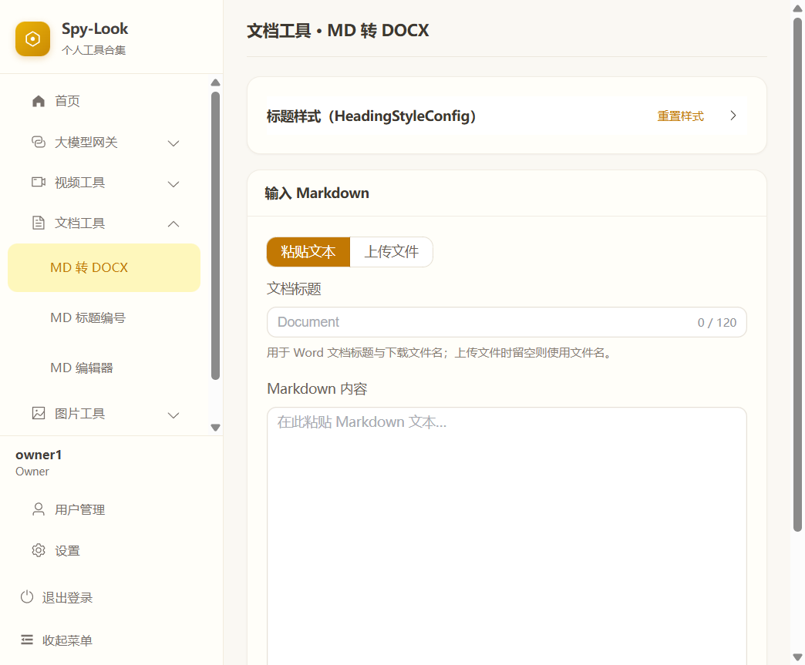

### 图片工具

本地 PP-OCRv6识别文字，另有公式识别与版面识别。

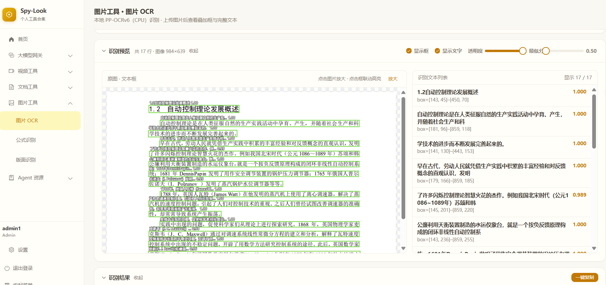


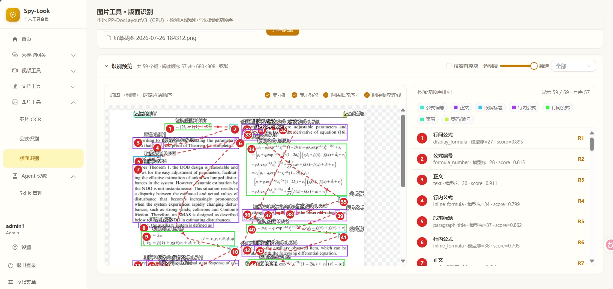


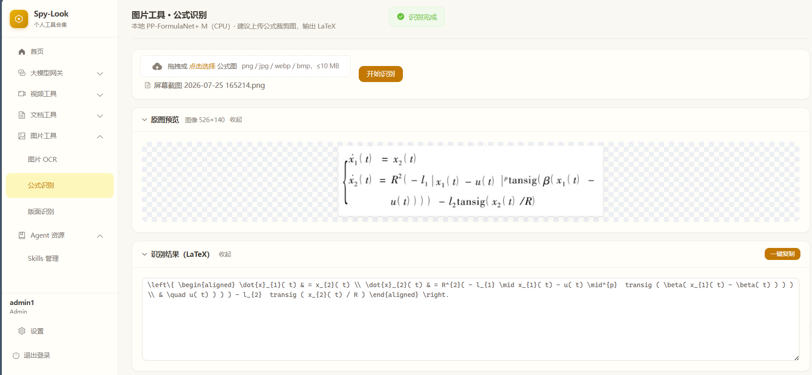

### Agent Skills

持久化管理 Agent Skills：Zip / 文件夹 / GitHub 导入，标签筛选，详情、版本与 zip 导出。

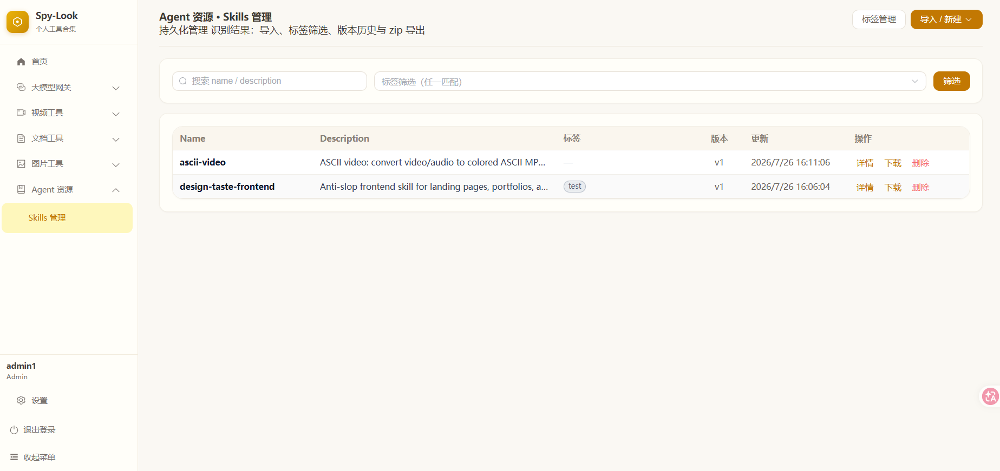

---

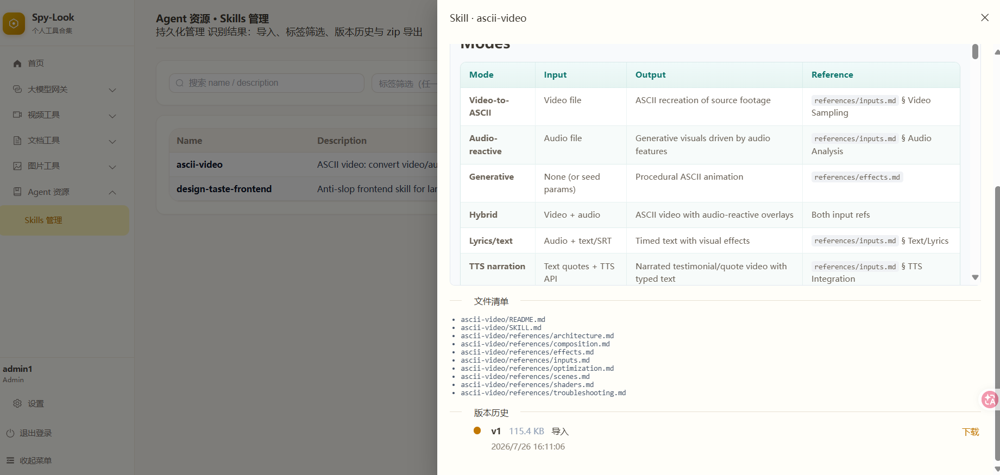

## 推荐上手顺序（网关）

1. 登录控制台 → **大模型网关 → 模型配置**：添加模型源、对外模型，并创建带 `app_id` 的 API Key  
2. 用 Key 调用 `/v1/chat/completions`（建议带 `X-Session-Id`）  
3. **请求日志** 中按 **应用 → 会话 → 日志** 查看详情  

---

## 技术栈

FastAPI · httpx · SQLite · Vue 3 · Element Plus · Vite

```
spy-look/
├── api/                 # FastAPI 后端（按工具模块化）
│   ├── main.py
│   ├── db/              # 共享 SQLite
│   └── tools/           # gateway / video_tools / doc_tools / …
├── ui/                  # Vue 控制台 → ui/dist 静态托管
├── screenshots/
├── boot.bat             # Windows 一键开发启动
└── openspec/
```

---

## 适合谁用

- 想把网关、视频转写、文档/图片处理、Agent Skills 收拢到一个本地服务
- 本地开发 / 小团队：给 LLM 调用加一层网关，看清每次请求
- 多下游服务：用 `app_id` + `X-Session-Id` 按业务与会话隔离日志
- 接新模型：能力探测页快速确认 Function Calling / JSON / Embedding 等是否可用

---

## License

见 [LICENSE](LICENSE)。
