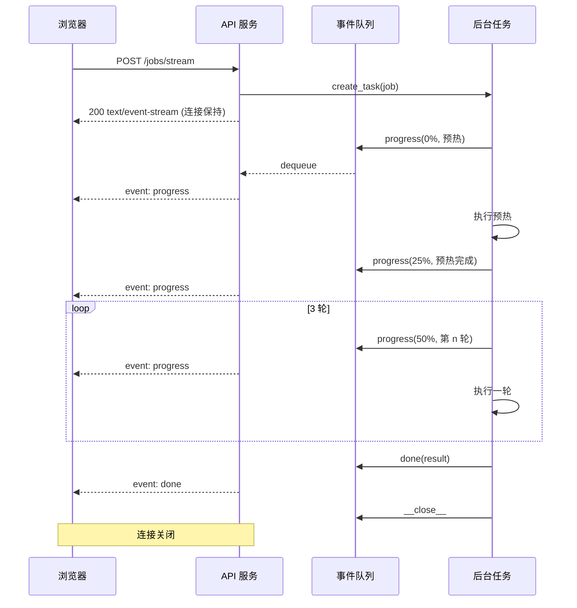

# 长任务流式进度展示

> 本文档描述一种通用的「长耗时任务 + 实时进度反馈」实现方案，与具体业务无关，可直接迁移到其他 Web 项目。

---

## 1. 要解决什么问题

用户点击「开始处理」后，如果后端要跑几十秒甚至几分钟，常见的两种做法都有明显缺陷：


| 方案                           | 问题                             |
| ---------------------------- | ------------------------------ |
| 普通 HTTP 请求，等全部完成再返回 JSON     | 前端长时间无反馈，用户以为页面卡死              |
| 前端用 `setInterval` 轮询「任务状态」接口 | 需要额外维护任务 ID、状态存储、轮询间隔；延迟高、实现啰嗦 |


更合适的方案：**在一次请求连接上，服务端持续推送进度事件，前端边收边更新 UI**。

---

## 2. 技术选型：SSE（Server-Sent Events）

### 2.1 什么是 SSE

SSE 是浏览器原生支持的单向流式协议：

- 服务端通过 `Content-Type: text/event-stream` 持续写出文本
- 每条消息格式固定，由 `event:` 和 `data:` 两行组成
- 浏览器用 `fetch` 读 `response.body` 流，或用 `EventSource`（仅支持 GET）

示例报文：

```http
HTTP/1.1 200 OK
Content-Type: text/event-stream
Cache-Control: no-cache

event: progress
data: {"percent": 25, "message": "正在处理第 1 步..."}

event: progress
data: {"percent": 50, "message": "正在处理第 2 步..."}

event: done
data: {"result": {"score": 98}}

```

### 2.2 为什么选 SSE 而不是 WebSocket


| 维度    | SSE           | WebSocket |
| ----- | ------------- | --------- |
| 通信方向  | 服务端 → 客户端（够用） | 双向        |
| 协议    | 普通 HTTP       | 需升级协议     |
| 实现复杂度 | 低             | 较高        |
| 适用场景  | 进度条、日志流、通知    | 聊天、协作编辑   |


**进度展示只需服务端单向推送**，SSE 通常是最简方案。

### 2.3 POST + SSE 的注意点

标准 `EventSource` 只支持 GET。若任务参数较复杂（选模型、上传文件等），更常见的是：

```javascript
fetch('/api/jobs/stream', {
  method: 'POST',
  headers: { 'Content-Type': 'application/json' },
  body: JSON.stringify({ ... }),
})
```

然后手动解析 `response.body` 的 ReadableStream（见第 5 节）。

---

## 3. 整体架构

```
┌─────────────┐     POST /jobs/stream      ┌─────────────┐
│   浏览器     │ ────────────────────────▶ │   API 服务   │
│             │ ◀── SSE: progress/done ── │             │
└─────────────┘                           └──────┬──────┘
                                                 │
                                          ┌──────▼──────┐
                                          │  后台任务    │
                                          │ (线程/进程)  │
                                          └─────────────┘
```

核心思路分三层：

1. **HTTP 层**：立刻返回 `StreamingResponse`，保持连接不断
2. **协调层**：异步生成器从队列里取事件，格式化成 SSE 写出
3. **执行层**：真正干活的任务在后台跑，通过回调往队列里塞进度

关键：**不要让 HTTP 处理函数本身阻塞在耗时逻辑上**，否则中间件、超时、连接管理都会变难。

---

## 4. 后端实现模式（以 Python/FastAPI 为例，概念通用）

### 4.1 SSE 格式化工具

```python
import json

def sse_event(event: str, data: dict) -> str:
    return f"event: {event}\ndata: {json.dumps(data, ensure_ascii=False)}\n\n"
```

约定：

- `event`：事件类型（如 `progress`、`done`、`error`）
- `data`：JSON 对象，结构由前后端共同约定

### 4.2 队列 + 后台任务 + 流式响应

```python
import asyncio
from typing import AsyncIterator

async def run_long_job_stream(request_body: dict) -> AsyncIterator[str]:
    queue: asyncio.Queue[tuple[str, dict]] = asyncio.Queue()
    loop = asyncio.get_running_loop()

    # 进度回调：可从同步线程安全地投递到异步队列
    def on_progress(message: str, percent: int, **extra):
        payload = {"message": message, "percent": percent, **extra}
        loop.call_soon_threadsafe(queue.put_nowait, ("progress", payload))

    async def job():
        try:
            # 若底层是 CPU/阻塞 IO，放到线程池
            result = await asyncio.to_thread(
                do_heavy_work,
                request_body,
                on_progress=on_progress,
            )
            await queue.put(("done", {"result": result}))
        except Exception as exc:
            await queue.put(("error", {"detail": str(exc)}))
        finally:
            await queue.put(("__close__", {}))  # 结束哨兵

    task = asyncio.create_task(job())

    try:
        while True:
            event, data = await queue.get()
            if event == "__close__":
                break
            yield sse_event(event, data)
            if event in ("done", "error"):
                break
    finally:
        if not task.done():
            task.cancel()
```

要点说明：


| 机制                          | 作用                |
| --------------------------- | ----------------- |
| `asyncio.Queue`             | 解耦「干活」和「写 HTTP 流」 |
| `call_soon_threadsafe`      | 同步代码（线程里）也能安全投递事件 |
| `asyncio.to_thread`         | 不阻塞事件循环           |
| `__close__` 哨兵              | 明确结束消费循环          |
| `finally` 里 `task.cancel()` | 客户端断开时清理后台任务      |


### 4.3 业务层如何上报进度

耗时函数接受可选回调，在关键节点调用：

```python
def do_heavy_work(params, on_progress=None):
    def report(msg, percent, **extra):
        if on_progress:
            on_progress(msg, percent, **extra)

    report("预热中...", 0)
    warmup()
    report("预热完成", 25)

    for i in range(1, 4):
        report(f"第 {i}/3 轮", 25 + (i - 1) * 25, run=i)
        run_once()
        report(f"第 {i} 轮完成", 25 + i * 25, run=i)

    report("生成报告...", 100)
    return {"avg": 42.5}
```

进度百分比建议按**已知步骤数**划分，而不是拍脑袋：

```
预热        0%  → 25%
第 1 轮    25%  → 50%
第 2 轮    50%  → 75%
第 3 轮    75%  → 100%
```

步骤内部若仍很慢，可在 `message` 里写清当前在做什么（如「等待上游响应…」），比假进度条更诚实。

### 4.4 路由挂载

```python
from fastapi.responses import StreamingResponse

@app.post("/api/jobs/stream")
async def start_job_stream(body: JobRequest):
    return StreamingResponse(
        run_long_job_stream(body.model_dump()),
        media_type="text/event-stream",
    )
```

保留一个**非流式** `POST /api/jobs` 也有价值：方便脚本、自动化测试、不需要 UI 的调用方。

---

## 5. 前端实现模式

### 5.1 解析 SSE 流（POST 场景）

```typescript
type SseHandler = (event: string, data: Record<string, unknown>) => void

async function streamPost(url: string, body: object, onEvent: SseHandler) {
  const res = await fetch(url, {
    method: 'POST',
    headers: { 'Content-Type': 'application/json' },
    body: JSON.stringify(body),
  })

  if (!res.ok) {
    const err = await res.json().catch(() => ({ detail: res.statusText }))
    throw new Error(err.detail ?? '请求失败')
  }
  if (!res.body) throw new Error('响应不支持流式读取')

  const reader = res.body.getReader()
  const decoder = new TextDecoder()
  let buffer = ''

  while (true) {
    const { done, value } = await reader.read()
    if (done) break

    buffer += decoder.decode(value, { stream: true })

    // SSE 以空行分隔消息块
    const blocks = buffer.split('\n\n')
    buffer = blocks.pop() ?? ''

    for (const block of blocks) {
      if (!block.trim()) continue

      let event = 'message'
      let dataStr = ''

      for (const line of block.split('\n')) {
        if (line.startsWith('event:')) event = line.slice(6).trim()
        else if (line.startsWith('data:')) dataStr = line.slice(5).trim()
      }

      if (dataStr) {
        onEvent(event, JSON.parse(dataStr))
      }
    }
  }
}
```

### 5.2 业务侧消费事件

```typescript
const testing = ref(false)
const percent = ref(0)
const message = ref('')
const result = ref(null)

async function startJob() {
  testing.value = true
  percent.value = 0
  message.value = '准备开始...'
  result.value = null

  try {
    await streamPost('/api/jobs/stream', { /* params */ }, (event, data) => {
      if (event === 'progress') {
        percent.value = Number(data.percent ?? 0)
        message.value = String(data.message ?? '')
      } else if (event === 'done') {
        result.value = data.result
        percent.value = 100
        message.value = '完成'
      } else if (event === 'error') {
        message.value = String(data.detail ?? '失败')
      }
    })
  } finally {
    testing.value = false
  }
}
```

### 5.3 UI 建议

长任务 UI 至少包含三要素，避免「假死感」：

1. **进度条**（已知步骤时显示百分比；未知总时长可用 indeterminate / 条纹动画）
2. **当前状态文案**（正在做什么）
3. **步骤列表**（可选，多阶段任务时更清晰）

```html
<div v-if="testing">
  <el-progress :percentage="percent" striped striped-flow />
  <p>{{ message }}</p>
  <ul>
    <li v-for="step in steps" :class="{ active: step.active, done: step.done }">
      {{ step.text }}
    </li>
  </ul>
</div>
```

---

## 6. 事件协议设计（前后端契约）

建议最少定义三类事件：


| event      | 含义   | data 示例                                                             |
| ---------- | ---- | ------------------------------------------------------------------- |
| `progress` | 中间进度 | `{ "stage": "run", "message": "第 2/3 轮", "percent": 50, "run": 2 }` |
| `done`     | 成功结束 | `{ "result": { ... }, "total_ms": 12345 }`                          |
| `error`    | 失败结束 | `{ "detail": "上游超时" }`                                              |


设计原则：

- **一种 event 一种语义**，不要混用
- `progress` 可带 `stage`、`percent`、`message` 等扩展字段
- 最终结果放在 `done` 里一次性返回，避免前端再发请求取结果
- 错误用 `error` 事件 + HTTP 200（流已建立）或直接在建立流前返回 4xx；团队选一种并统一

---

## 7. 时序图




---

## 8. 常见问题与对策

### 8.1 反向代理缓冲

Nginx 等可能缓冲 `text/event-stream`，导致进度「攒一批才显示」。对策：

```nginx
location /api/ {
    proxy_buffering off;
    proxy_cache off;
    proxy_read_timeout 3600s;
}
```

### 8.2 连接超时

网关、负载均衡、浏览器对长连接都有超时。对策：

- 调大 `proxy_read_timeout`
- 可选：每 15–30 秒发一条注释行或 heartbeat（`: ping\n\n`）保活

### 8.3 客户端关闭页面

用户刷新或关标签时，服务端应在 `finally` 里 `cancel` 后台任务，避免孤儿任务占资源。

### 8.4 同步库跑在线程里

数据库驱动、httpx 同步客户端、文件处理等应放 `to_thread` / 线程池；**不要在 async 路由里直接阻塞**。

### 8.5 进度百分比的真实性

- **已知步骤**：按步骤均分百分比（本方案）
- **未知总时长**：不用百分比，用阶段文案 + 不确定进度条（`indeterminate`）
- **可量化子进度**：如「已处理 30/100 条」可换算成真实比例

切忌用假的 `setInterval` 在前端模拟进度却不反映真实后端状态——用户会发现进度跑满但还在等。

### 8.6 与 WebSocket 的边界

若后续需要「用户中途取消」「暂停/恢复」等双向交互，可升级为 WebSocket；仅展示进度时 SSE 足够。

---

## 9. 最小可运行骨架（伪代码汇总）

**后端**

```text
POST /jobs/stream
  → StreamingResponse(event_stream())
  → event_stream:
       创建 Queue
       启动 asyncio.Task(run_job)
       loop:
         从 Queue 取 (event, data)
         yield sse_event(event, data)
         若 done/error/__close__ 则 break
       finally: cancel task

run_job:
  try:
    result = await to_thread(heavy_work, on_progress=...)
    queue.put(done, result)
  except:
    queue.put(error, ...)
  finally:
    queue.put(__close__)

heavy_work(on_progress):
  在关键节点 on_progress(message, percent, **extra)
```

**前端**

```text
streamPost(url, body, handler):
  fetch POST → 读 body 流
  按 \n\n 切分 SSE 块
  解析 event / data → handler(event, JSON.parse(data))

startJob():
  显示进度 UI
  streamPost(..., (event, data) => {
    progress → 更新条和文案
    done     → 展示结果
    error    → 提示错误
  })
  finally: 关闭 loading
```

---

## 10. 延伸阅读

- [MDN: Server-sent events](https://developer.mozilla.org/en-US/docs/Web/API/Server-sent_events)
- [HTML 标准 SSE 格式](https://html.spec.whatwg.org/multipage/server-sent-events.html)
- FastAPI `StreamingResponse` 文档
- 对比方案：任务队列（Celery/RQ）+ 轮询、WebSocket、HTTP/2 Server Push（已不推荐）

---

## 11. 一句话总结

> **长任务不要等整包 JSON：用 SSE 保持一条 HTTP 连接，后台任务通过队列往连接上推 `progress` / `done` / `error` 事件，前端流式解析并更新进度条与状态文案。**

这是「足够简单、足够好用」的进度展示主路径；只有当你确实需要双向实时通信时，再考虑 WebSocket。